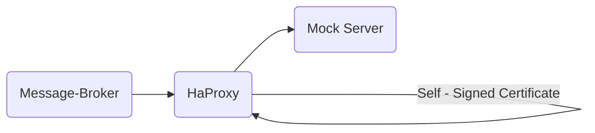

# Cert Test

This is a simple test setup to showcase how a self-signed certificate can be used in conjunction with the message broker
service.

## Process of adding additional certificates

Since the message broker service is based on an [Eclipse Temurin](https://hub.docker.com/_/eclipse-temurin) Java image
it's inevitable that a Java truststore needs to be used. However, this cannot be altered without root permissions. Thus,
altering the file within a non-root context is not possible and requires the following workflow instead:

1. Copy the bundled truststore from the used base Docker image to your local system
2. Alter the copied truststore using a Docker container with `keytool` being installed to import additional certificates
   being mounted
3. Mount the altered truststore to the message broker container to `/opt/java/openjdk/lib/security/cacerts` (default
   truststore)

## Test setup



The `HaProxy` is set up in a way so that it handles all requests on port `443` and doing SSL termination using the
self-signed certificate. The message broker service is configured so that all potential requests to the Hub side is
routed to the proxy.

_The hub services will NEVER be requested!_

## Running the test setup

1. Ensure having a registered node with a public/private key configured (__do not use the one you would use for
   production!__)
2. Copy the node's robot secret to `./config/secrets/robot-secret-node.txt`
3. Copy the node's private key to `./config/secrets/priv-key-node.pem`
4. (Optional) Remove trailing newlines from the two files by running

```shell
truncate -s -1 ./config/secrets/robot-secret-node.txt ./config/secrets/priv-key-node.pem 
```

5. Create self-signed certificates by running `./create-cert.sh`
6. Ensure the main project has been built by running `mvn -B -DskipTests package`
7. Start the setup by running `docker compose up --build -d`

The process will spin up all required services. However, the message broker will _NOT_ be able to connect to any hub
related services since the setup is backed by a mock server which is simply returning `200` status codes all the time.

__It's only important that the message broker is not throwing any `PKIX` exceptions which would indicate a certificate
error.__
