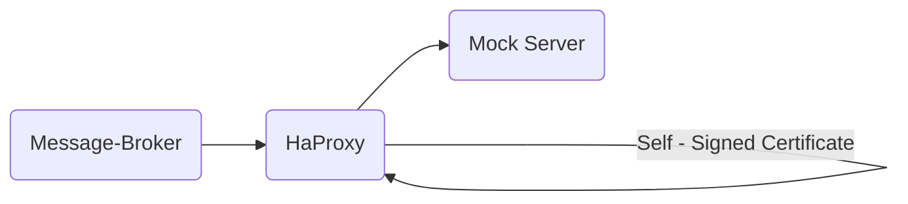

# Cert Test

This is a simple test setup to showcase how a self-signed certificate can be used in conjunction with the message broker
service.

## Process of adding additional certificates

The message broker is based on an [Eclipse Temurin](https://hub.docker.com/_/eclipse-temurin) Java image and internally
using the [Spring framework](https://spring.io/projects/spring-framework). Both of these have their own variants of
providing additional certificates. Temurin allows for mounting a custom trust store. However, this requires the use of
Java's [keytool](https://docs.oracle.com/javase/8/docs/technotes/tools/unix/keytool.html) which is cumbersome during
deployment. Spring itself offers providing certificate bundles. However, this approach does not make use of existing
certificates and thus is also not applicable.

Instead, the message broker allows to provide additional certificates by setting the environment variable
`SECURITY_ADDITIONAL_TRUSTED_CERTS_FILE` to point the application to a certificate bundle file. This certificate bundle
is loaded during application startup and added to already existing trust material. This composed trust material is then
used in client implementations for outgoing connections.

## Test setup



The `HaProxy` is set up in a way so that it handles all requests on port `443` and doing SSL termination using the
self-signed certificate. The message broker service is configured so that all potential requests to the Hub side is
routed to the proxy.

_The hub services will NEVER be requested!_

## Running the test setup

1. Ensure having a registered node with a public/private key configured (__do not use the one you would use for
   production!__)
2. Copy the node's robot secret to `./config/secrets/robot-secret-node.txt`
3. Copy the node's private key to `./config/secrets/priv-key-node.pem`
4. (Optional) Remove trailing newlines from the two files by running

```shell
truncate -s -1 ./config/secrets/robot-secret-node.txt ./config/secrets/priv-key-node.pem 
```

5. Create self-signed certificates by running `./create-cert.sh`
6. Ensure the main project has been built by running `mvn -B -DskipTests package`
7. Start the setup by running `docker compose up --build -d`

The process will spin up all required services. However, the message broker will _NOT_ be able to connect to any hub
related services since the setup is backed by a mock server which is simply returning `200` status codes all the time.

__It's only important that the message broker is not throwing any `PKIX` exceptions which would indicate a certificate
error.__
