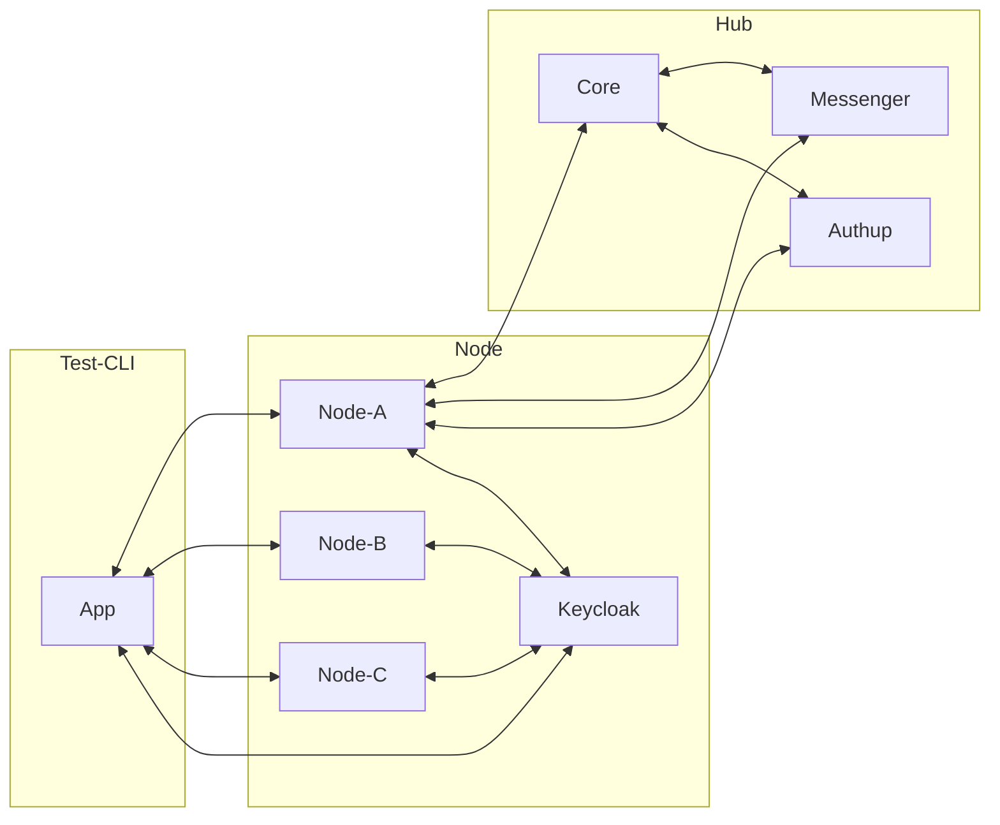

# System Tests

Goal of these tests is to test the message broker in an environment that tries to resemble a real production
environment. This includes the communication with the Hub but _excludes_ analysis because their requests can easily be
simulated.

## Requirements

The following dependencies need to be satisfied in order to run the tests:

- Golang in version ~1.23.3
- OpenSSL binary
- Docker / Docker Compose
- [jq](https://github.com/jqlang/jq) binary
- xxd binary
- curl binary

## The Test Environment



__NOTE__: _Connections from other nodes than `Node-A` to any hub component have been left out for brevity._

The test environment is made up out of Hub and Node components that are necessary to establish a working messaging
communication channel.

This includes on the Hub side (with their respective dependencies):

- Authentication service (authup)
- Core component
- Messenger component

See [docker-compose.yml](./environment/hub/hub-docker-compose.yml) for more information.

This includes on the Node side (with their respective dependencies):

- Authentication service (Keycloak)
- 3 different nodes

See [docker-compose.yml](./environment/node/node-docker-compose.tpl.yml) for more information.

### Network Specifics

In order to resemble an environment that is close to a real world environment (without being reliant on k8s) 3 different
networks are at play that isolate different containers from each other. The following networks at play are realised
using Docker:

- hub
- node
- hub-node-intercomm

See [network setup script](./environment/resources/network/setup-test-networks.sh) for more information.

### Runtime Specifics

Based on how the message broker is implemented some pre-requisites need to be met.

This requires the following resources to be present on the Hub side:

- node information (for every node instance)
- analysis information
- analysis node information (for every node instance)
- project node information (for every node instance)
- project information
- robot account information

### Secrets

Required secrets will be dynamically created on every run. This includes key pairs as well as credentials for each robot
account associated with a single node instance.

## Running Tests

In order to run the tests you have to:

1. build the message broker (if not already built)
    ```shell
    mvn -B -DskipTests package 
    ```
2. build the CLI for running system tests
   ```shell
   go build -C ./system-tests/tests/
   ```
3. run the tests
    ```shell
   ./system-tests/run.sh
    ```

The third step will spin up the whole test environment and subsequently run the tests against it. The script also takes
care of cleaning up any resources in the end.
